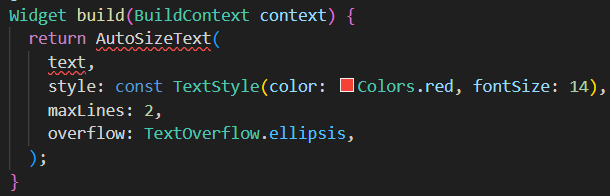

# flutter_plugin_pubdev

A new Flutter project.

# Praktikum
## Langkah 1: Buat Project Baru

## Langkah 2: Menambahkan Plugin

## Langkah 3: Buat file red_text_widget.dart

## Langkah 4: Tambah Widget AutoSizeText

## Langkah 5: Buat Variabel text dan parameter di constructor

## Langkah 6: Tambahkan widget di main.dart

# Tugas Praktikum
## Jelaskan maksud dari langkah 2 pada praktikum tersebut!
Menambahkan plugin auto_size_text melalui terminal, dimana nanti plugin tersebut akan muncul pada file pubspec.yaml di bagian dependencies
## Jelaskan maksud dari langkah 5 pada praktikum tersebut!
Dengan mendeklarasikan final String text; RedTextWidget bisa menerima data text dari luar, dan menambahkan required this.text membuat setiap RedTextWidget digunakan harus mengisi data tersebut terlebih dahulu
## Pada langkah 6 terdapat dua widget yang ditambahkan, jelaskan fungsi dan perbedaannya!
* Container 1(yang atas): menampilkan teks menggunakan widget RedTextWidget, yang textnya sudah disesuaikan menggunakan auto_size_text di file red_text_widget.dart
* Container 2(yang bawah): menampilkan teks secara manual menggunakan const Text bawaan dari flutter
## Jelaskan maksud dari tiap parameter yang ada di dalam plugin auto_size_text berdasarkan tautan pada dokumentasi ini !
* text: parameter ini berisi data text yang ingin ditampilkan
* style: parameter ini digunakan untuk mengatur gaya visual teks
* maxLines: parameter ini digunakan untuk membatasi teks agar hanya bisa ditampilkan
* overflow: parameter ini digunakan untuk menentukan apa yang akan terjadi jika teks melebihi maxLines